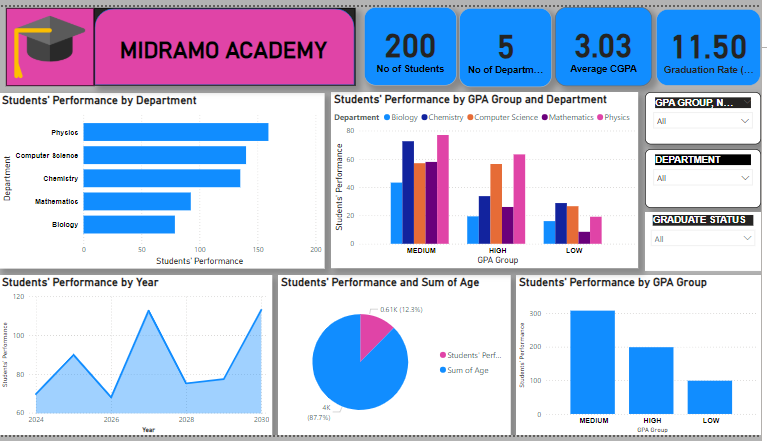
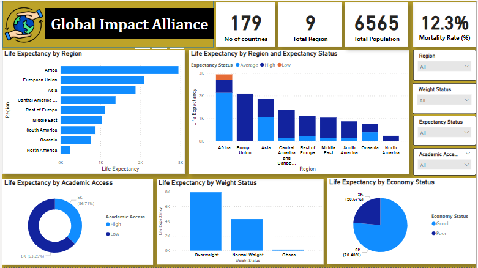
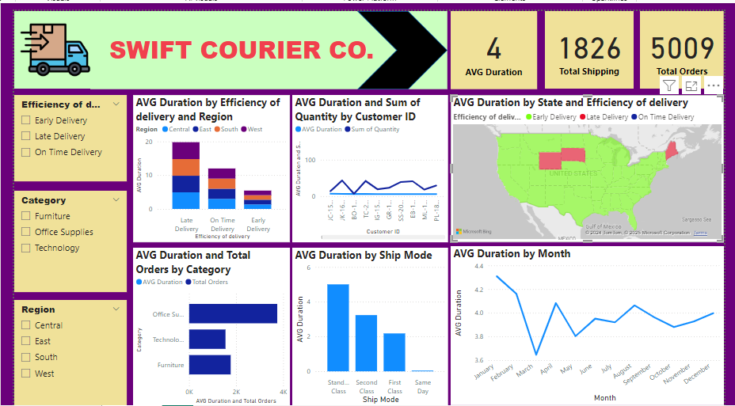

<!--Section 1: Introduce your self-->
## ABOUT ME

Hello! I'm William Njoku 😃. A writer, financial trader, and data analyst with a passion for turning data into actionable insights. With experience across sales, operations, finance, and customer service, I help businesses solve challenges and unlock growth.

<!--Mention your top/relevant skills here - core and soft skills-->
## WHAT I DO 

*As a skilled data analyst and Financial Trader with expertise in statistical analysis, predictive modeling, and data visualization, I leverage tools like Power Bi, Excel, SQL, Tableau, and Python in a bid to uncover trends and drive decision-making. .*

**- ✅ Data Analytics Consulting.**
I provide in-depth analysis and tailored solutions to help you make data-driven decisions, optimize processes, and drive business growth by creating automated dashboards, optimizing data pipelines, and conducting in-depth analyses in order to support business objectives. I have an absolute dedication to solving problems, enhancing efficiency, and to deliver data-driven solutions to achieve quantifiable outcomes.

**- ✅ Writing and Project Development.**
I offer comprehensive and compelling content across various formats, including articles, blogs, and creative storytelling. While paying attention to every detail, I am committed to delivering engaging and impactful narratives; with a specialty in creating content to connect with diverse audiences. My skill includes Persuasive communication, proofreading and editing to ensure consistency and clarity. I focus on providing creativity and precision to every piece whether i'm collaborating on creative projects or producing strategic marketing materials.

<!--Section 2: List 3-4 key projects-->
## MY PORTFOLIO 

*A glimpse of some of the projects I've been working on.*

**Descriptive & Predictive Analysis on Student Performance.**

The analysis focused on each student's academic performance, identifying overall trends and highlighting areas for improvement.
The analysis process transitioned from getting the data to cleaning it and transforming it into a well-comprehensive report, using dashboards to demonstrate fundamental metrics with charts like timelines, bar graphs, and pie charts.

**Predictive Analytic Report on Life Expectancy**

A well-presented analytic report that creates a clear overview of the life expectancy and mortality rate of the population; using a dashboard with charts and graphs etc. to narrate the perspective.

**Predictive Modeling and Hypothesis Testing on the efficiency of delivery**

A comprehensive analytic report on the efficiency of delivery from a courier company. 
Presenting insights into the effectiveness of the brand’s ability to deliver products consumers order. 

## CONTACT DETAILS

*Let’s connect and see how we can make a difference together!*
<table>
  <tbody>
    <tr>
      <td>📧</td>
      <td><a href="mailto:Williamnjoku007@gmail.com">Williamnjoku007@gmail.com</a></td>
    </tr>
    <tr>
      <td>📞</td>
      <td>(234) 903-274-6686</td>
    </tr>
    <tr>
      <td>📍</td>
      <td>Lagos, Nigeria</td>
    </tr>
    <tr>
      <td>⬇️</td>
      <td><a href="William Njoku PDF.pdf">Download my CV</a></td>
    </tr>
    <tr>
      <td>🌐</td>
      <td><a href="https://linkedin.com/in/william-njoku-143b51259">The things I do daily on LinkedIn</a></td>
    </tr>
    <tr>
  </tbody>
</table>

Raw File by William Njoku.txt
Displaying Raw File by William Njoku.txt.
