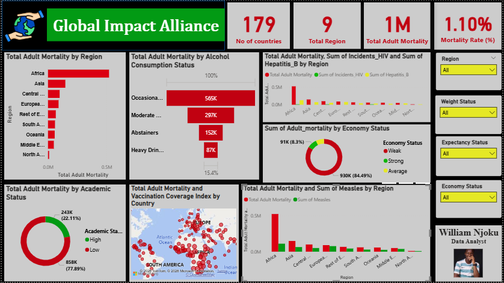
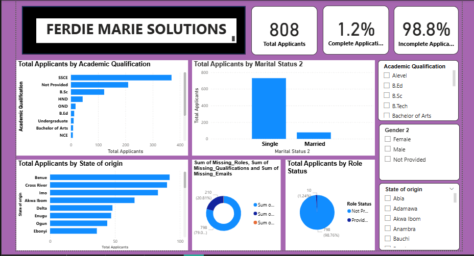
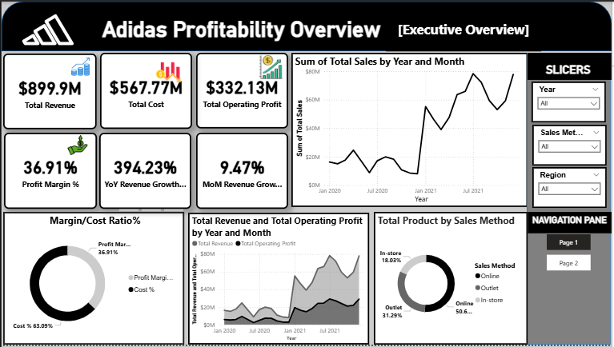
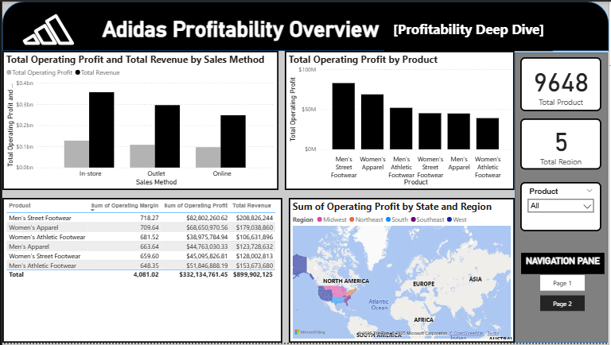

<!--Section 1: Introduce your self-->
## ABOUT ME

Hello! I'm William Njoku 😃. A writer, financial trader, and data analyst with a passion for turning data into actionable insights. With experience across sales/customer service, operations, finance, and health, I help businesses solve challenges and unlock growth.

<!--Mention your top/relevant skills here - core and soft skills-->
## SKILLS

*As a skilled data analyst and Financial Trader with expertise in statistical analysis, predictive modeling, and data visualization, I leverage tools like Power Bi, Excel, SQL, Tableau, and Python in a bid to uncover trends and drive decision-making. .*

**- ✅ Data Analytics Consulting.**
I provide in-depth analysis and tailored solutions to help you make data-driven decisions, optimize processes, and drive business growth by creating automated dashboards, optimizing data pipelines, and conducting in-depth analyses in order to support business objectives. I have an absolute dedication to solving problems, enhancing efficiency, and to deliver data-driven solutions to achieve quantifiable outcomes.

**- ✅ Writing and Project Development.**
I offer comprehensive and compelling content across various formats, including articles, blogs, and creative storytelling. While paying attention to every detail, I am committed to delivering engaging and impactful narratives; with a specialty in creating content to connect with diverse audiences. My skill includes Persuasive communication, proofreading and editing to ensure consistency and clarity. I focus on providing creativity and precision to every piece whether i'm collaborating on creative projects or producing strategic marketing materials.

<!--Section 2: List 3-4 key projects-->
## MY PROJECTS

*A glimpse of some of the projects I've been working on.*

**User Performance & Engagement Analytics Dashboard**

Analyzed user performance data to identify behavioral patterns, performance trends, and improvement opportunities.
Built KPI dashboards visualizing engagement and outcome metrics.
Conducted exploratory analysis to uncover factors influencing user success.
[Read More](https://docs.google.com/document/d/1MP6LmWax66a-NdAeyINAORYnM5Kdteyw0Wf8PnobghM/edit?usp=sharing)

**Global User Outcome Trends & Predictive Analytics**

A well-presented analytic report that creates a clear overview of the adult mortality rate of the global population; using a dashboard with charts and graphs etc. to narrate the perspective. 
Analytical Techniques Applicable to Product Analytics
(show modeling + trend forecasting skills)
A step-by-step documented presentation of the project. 
[Read More](https://docs.google.com/document/d/1LL2zoYgI08M5D3YfKr5nAUodQCQ60A8UpeTagt93WMk/edit?usp=sharing)

**Operational Efficiency & Service Performance Analysis**

Analytic report on operational delivery data to identify service performance bottlenecks and service delays.
Applied hypothesis testing to evaluate process efficiency.
Generated actionable insights to improve operational workflows and customer experience.. 

**User Funnel & Conversion Analysis — Recruitment Pipeline**

Analytic report on user journey data to evaluate application completion rates and drop-off points.
Assessed data completeness and process efficiency to improve conversion outcomes.
Delivered prescriptive insights to optimize workflow and user experience.

**Revenue & Product Performance Analytics — Retail Dataset**

Designed and developed interactive dashboards to track product performance, profitability, and growth metrics, creating KPIs such as MoM growth, profit margins, and revenue performance, and delivering executive-level insights that supported strategic product decision-making.

**Adidas Profitability Insights Dashboard {Profitability Deep Dive}**

This project however, explores Adidas’ profitability performance using Power BI and DAX.
It highlights key metrics such as total revenue, cost %, profit margin %, and month-over-month growth.

🔹 Tools: Power BI, DAX, Excel
🔹 Skills: Data Modeling, KPI Design, Business Intelligence
🔹 Output: 2-page interactive dashboard for executive and analytical insights.

## CONTACT DETAILS

*Let’s connect and see how we can make a difference together!*
<table>
  <tbody>
    <tr>
      <td>📧</td>
      <td><a href="mailto:Williamnjoku007@gmail.com">Williamnjoku007@gmail.com</a></td>
    </tr>
    <tr>
      <td>📞</td>
      <td>(234) 903-274-6686</td>
    </tr>
    <tr>
      <td>📍</td>
      <td>Lagos, Nigeria</td>
    </tr>
    <tr>
      <td>⬇️</td>
      <td><a href="William Njoku Product Analyst Resume.pdf">Download my CV</a></td>
    </tr>
    <tr>
      <td>🌐</td>
      <td><a href="https://linkedin.com/in/william-njoku-143b51259">The things I do daily on LinkedIn</a></td>
    </tr>
    <tr>

